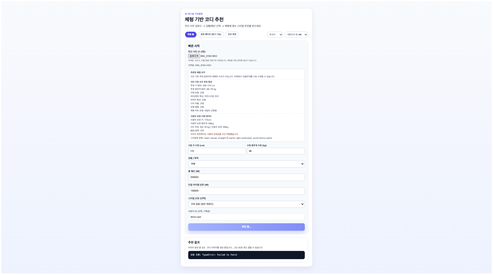
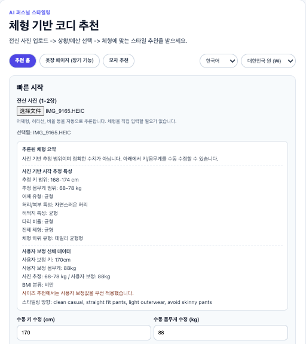
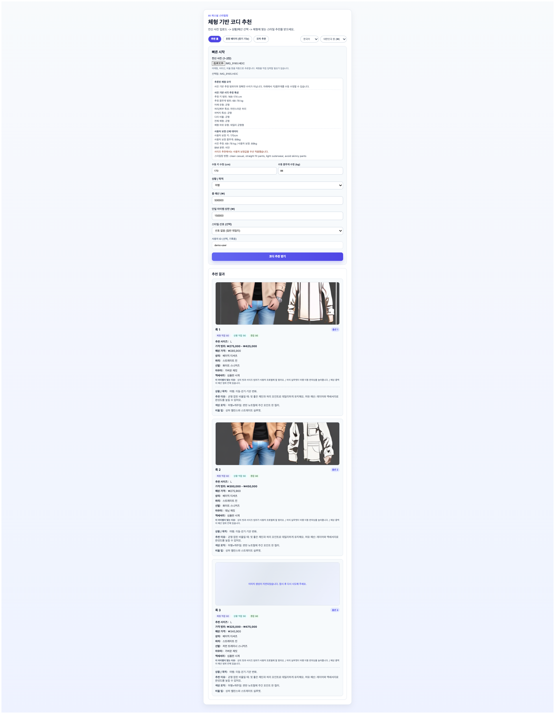
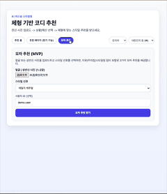

# AI Personal Styling MVP

An AI-powered system that helps users quickly answer:

> **“What outfits actually suit my body?”**

AI 기반 퍼스널 스타일링 MVP 프로젝트로,  
사용자의 체형에 맞는 코디를 빠르게 추천하는 서비스입니다.

---

## 🎥 Demo

> Upload → Analyze → Recommend → Generate  
> 사용자 사진 업로드 → 체형 분석 → 코디 추천 → 이미지 생성

---

## 🧠 Overview

- Upload a full-body photo
- Input basic info (height, weight, scenario)
- Get **body-aware outfit recommendations**

본 프로젝트는 단순 모델이 아닌,  
실제 사용자 경험을 고려한 **제품 수준의 MVP**입니다.

---

## ⭐ Highlights

- Body-aware recommendation system (체형 기반 추천)
- Handled **Replicate API rate limit (429)** with sequential generation
- Modular architecture (Outfit / Hat / Wardrobe)
- i18n support (KR / CN / EN)
- UX-focused design (estimated values + manual correction)

---

## 📸 Features & Screens

### 1️⃣ Input Flow

> Upload photo + enter user data

---

### 2️⃣ Body Analysis

> Estimated body profile (range-based)

---

### 3️⃣ Outfit Recommendation ⭐ Core

> 3 outfit looks with explanation + generated preview

---

### 4️⃣ Image Generation (Async UX)

> Sequential generation (1/3 → 2/3 → 3/3)

---

### 5️⃣ Hat Recommendation

> Independent recommendation module

---

## ⚙️ Tech Stack

| Layer    | Stack |
|----------|--------|
| Frontend | React, TypeScript, Vite |
| Backend  | FastAPI, Python 3.12 |
| AI API   | Replicate (SDXL) |
| i18n     | react-i18next |
| Config   | dotenv |

---

## ⚠️ Challenges

### 1. API Rate Limit (Replicate)
- Burst limit: 1 request  
- Solution:
  - Sequential generation
  - Delay (7–8s)
  - Retry logic  

---

### 2. Prompt Stability
- Prevented:
  - shirtless / muscular outputs  
- Used:
  - clothing-first prompts  
  - negative prompts  

---

### 3. Honest Body Analysis
- Height / weight shown as **ranges**
- User can manually adjust

---

## 🔮 Future Work

- Virtual try-on (image-to-image)
- Real body segmentation model
- Wardrobe system (DB integration)
- Async job queue
- User accounts

---

## 📌 Project Type

> **AI Product MVP (Fullstack + API Integration)**

단순 AI 모델이 아닌  
👉 실제 서비스 형태의 MVP 구현

---

## 📄 License

Portfolio use
